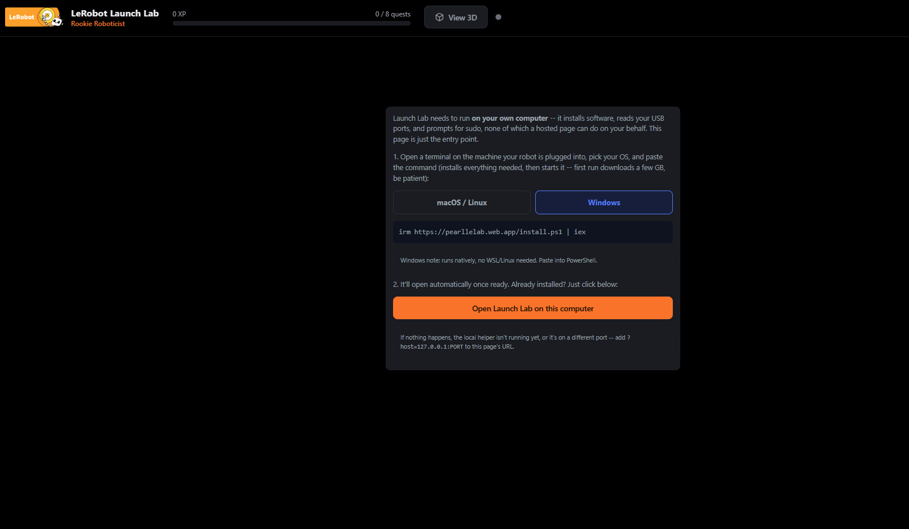
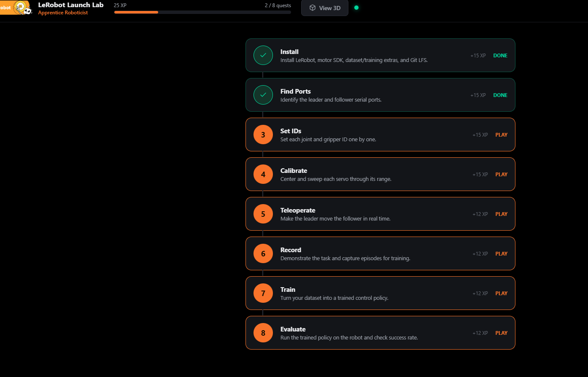
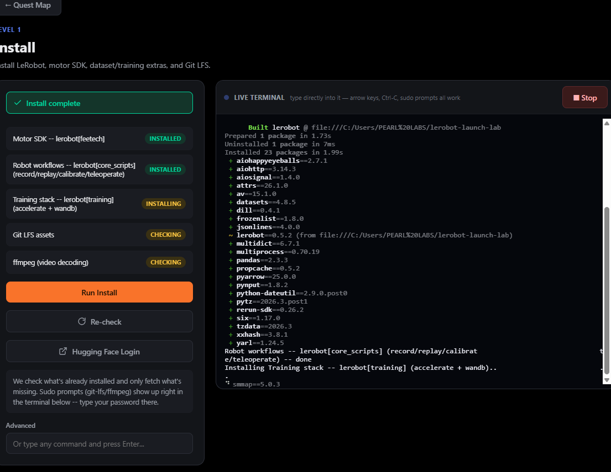
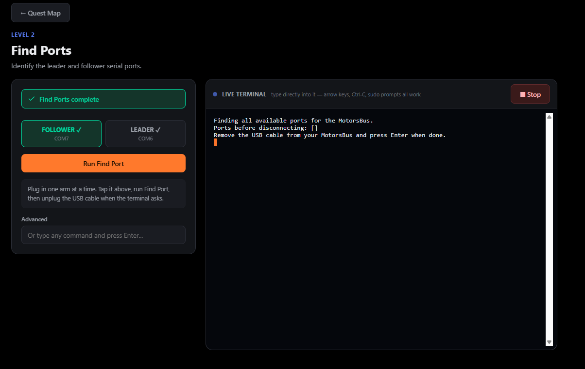
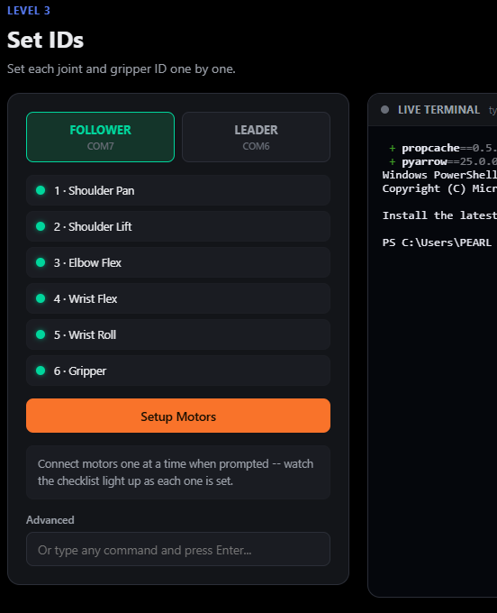
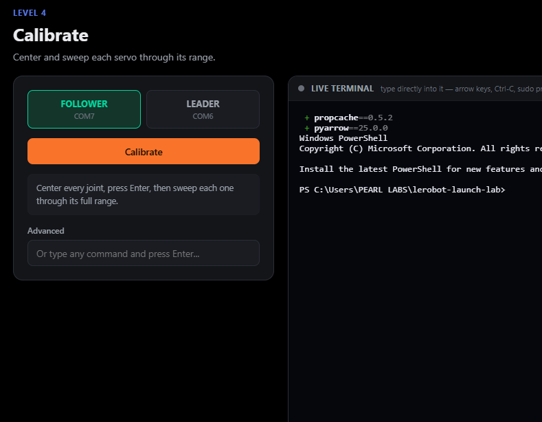
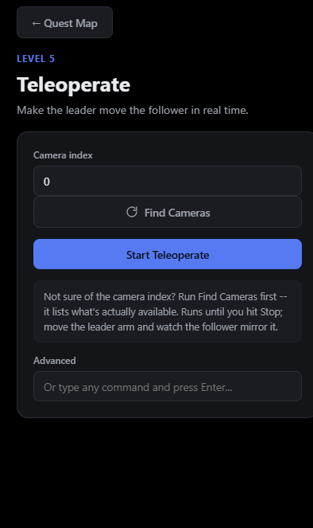
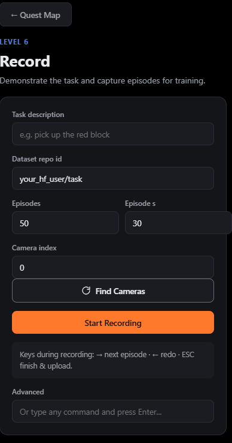
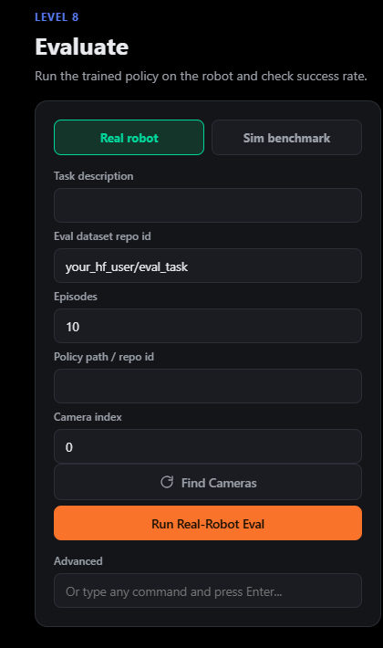

# LeRobot Launch Lab — A Simple Guide

**Made by Ahimbisbwe Paul, Pearl Labs, Uganda.**

---

## What is this?

Launch Lab is a friendly helper app for setting up a real robot arm (the SO-101) and
teaching it to do tasks — without needing to memorize or type long, complicated
commands in a computer terminal.

Think of it like a **video game map**. Each step you need to do — installing
software, finding your robot's plugs, calibrating the joints, teaching it a task — is
one "level" on the map. You click a level, press a button, follow the instructions on
screen, and move to the next one. That's it.

## Where this started

Setting up a robot arm the normal way means typing many long commands into a
terminal, in exactly the right order, with no mistakes. That's hard for someone doing
it for the very first time. Launch Lab was built to turn that whole process into
something anyone can follow — click, read, do what it says, click next — while still
giving you a **real terminal** underneath, so nothing is hidden or faked.

## What you need before you start

- A computer running **Windows, Linux, or macOS**.
- The **SO-101 robot arm** (both the arm that moves on its own, called the
  *follower*, and the arm you move by hand to control it, called the *leader*).
- A USB cable to connect the robot to your computer.
- An internet connection (needed the first time, to download everything).
- **At least 15 GB of free disk space.** The app itself is small, but it downloads
  some heavy tools it depends on (things like PyTorch, used for AI) which take up
  several gigabytes. Give yourself 15 GB to be safe — more if you plan to train your
  own AI models later, since those also need space.

## How to open it

1. Go to this web page: **https://pearllelab.web.app**
2. It will show you one command to copy.
   - **Mac or Linux:** open a program called "Terminal", paste the command, press
     Enter.
   - **Windows:** open "PowerShell", paste the command, press Enter.
3. Wait for it to finish. The first time, this takes a while because it's downloading
   everything it needs — this is normal, just be patient.
4. When it's done, the app opens automatically in your web browser.

You only need to do this download once. After that, running the same command again
just opens the app — it won't download everything from scratch a second time.

## How to use it

Once it's open, you'll see a map with 8 levels:

1. **Install** — gets all the software ready.

   
2. **Find Ports** — figures out which USB plug is which arm.

   
3. **Set IDs** — gives each motor in the arm a name/number so the computer can talk
   to it individually.

   
4. **Calibrate** — teaches the robot the full range each joint can move.

   
5. **Teleoperate** — you move the leader arm with your hand, and the follower arm
   copies you in real time.

   
6. **Record** — you demonstrate a task (like picking up an object) several times, and
   the app saves those demonstrations.

   
7. **Train** — turns your recorded demonstrations into an AI "brain" for the robot.
8. **Evaluate** — lets the trained AI control the robot by itself, and checks how
   well it does.

   

You can do the levels in order, or jump around freely — whatever you need. Each
level has clear buttons and a live terminal underneath, so you can always see exactly
what's happening.

## If something goes wrong

Every level has a real terminal, so if something fails, you'll see the actual message
explaining why — not just "error." Read it, it usually tells you exactly what to fix
(for example, "plug in your camera" or "reconnect the USB cable"). If a step still
doesn't make sense, that terminal output is also the most useful thing to share when
asking for help.

---

*Launch Lab — built to make robotics setup something anyone can do, not just
engineers.*
